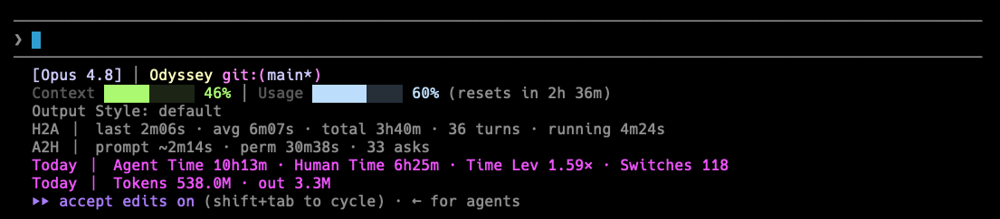

# Claude Code ROA — Return on Attention

**Measure how much agent work each hour of your attention moves.**

When you work with coding agents, the scarce resource is not tokens — it's *your
attention*. It's the one serial station: an agent can run while you look away,
but only you can decide, unblock, and redirect. ROA turns that idea into a live
gauge and a set of reports, straight from Claude Code's own hooks. No wrappers,
no account, all local.



*The top two lines are [claude-hud](https://github.com/jarrodwatts/claude-hud)
(identity, context/usage); everything below — Output Style, H2A, A2H, and the two
`Today` bands — is ROA, appended beneath it.*

> A `Time Lev` of 1.59× means that for every hour of your active attention, you
> pulled 1.59 agent-hours of work — because parallel sessions add up.

## What it measures

- **H2A** (*you wait the agent*) — time the agent is actually working. Permission
  waits are carved out, because those are the agent waiting on *you*.
- **A2H** (*the agent waits you*) — split into **prompt wait** (between turns) and
  **permission wait** (mid-turn, blocked on your approval).
- **Time Leverage** = AI working time ÷ your active wall-clock. Parallel sessions
  sum, so this goes above 1× when you orchestrate.
- **Tokens** — output (the real work) vs total (mostly cache re-reads — a
  footprint), plus **Token Leverage** (output per active minute, speed-invariant).
- **Switches** — how often you hop between sessions (attention fragmentation).
- **Session health** — whether sessions close same-day or drag across days.

It's a directional dashboard, not a precise score. See [docs/design.md](docs/design.md).

## Install

ROA is a Claude Code plugin distributed as its own marketplace.

```
/plugin marketplace add yuchenz27/claude-code-roa
/plugin install roa@claude-code-roa
```

The hooks load automatically and data collection starts immediately. To turn on
the live statusline HUD (a plugin can't set `statusLine` itself), run the setup
skill once:

```
/setup        # wires statusLine into your settings.json, then restart
```

ROA composes with **any** statusline, not just one. Claude Code has a single
`statusLine` slot, so ROA renders *below* whatever upstream statusline you already
run: set `ROA_WRAP` to that command and ROA appends its lines beneath it (leave it
unset for a clean ROA-only statusline). `/setup` also recognizes
[claude-hud](https://github.com/jarrodwatts/claude-hud) and wires it for you.

Reports, any time:

```
/roa            # today + leverage / tokens / permission / session health
/roa --today
```

…or from a shell: `python3 <repo>/bin/report --today`.

## Where the data lives

Everything is local, under `~/.claude/roa/` (override with `ROA_DIR`):

```
~/.claude/roa/
├── observer-YYYY-MM-DD.jsonl   # per-day event log (submit/stop)
├── state/<session_id>.json     # per-session running totals
├── active.json                 # active session + today's switch count
└── daily.jsonl                 # one summary line per day (permanent trend)
```

Code and data are kept separate on purpose: the plugin can be updated or
reinstalled without ever touching your history.

## Develop

It's plain Python, no build step. Point your own hooks at a working copy and
edits go live on the next hook fire:

```
git clone <repo> && cd claude-code-roa
python3 tests/test_core.py      # run the test suite (zero deps)
```

The logic lives in `src/roa/core.py` (pure, replayable); `tracker.py` / `hud.py`
/ `report.py` are thin I/O around it; `bin/` holds the entrypoints hooks call.

## License

MIT — see [LICENSE](LICENSE).
